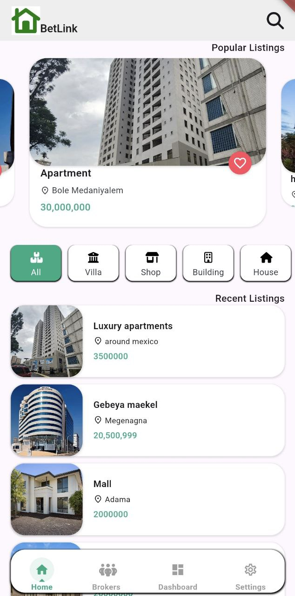
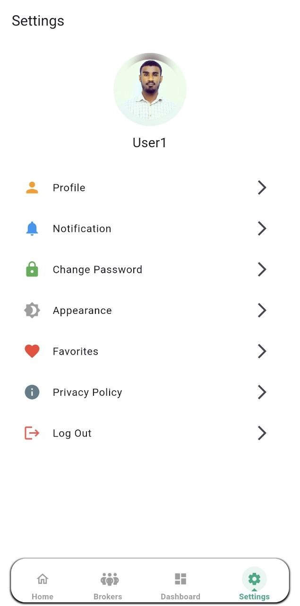
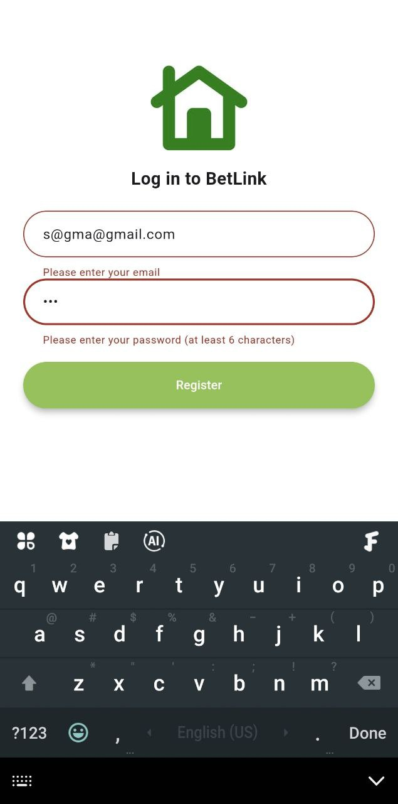

# BetLink

The **Bet Link** is a Flutter application designed to connect buyers and sellers of properties (houses, shops, and buildings). Sellers can register as agents or brokers and post their properties for interested buyers to discover.

## Features

- **User Authentication**: Sellers can create accounts and log in securely.
- **Property Listings**: Sellers can add details about their properties, including descriptions, images, and pricing.
- **Search and Filter**: Buyers can search for properties based on location, type, and price range.
- **Contact Sellers**: Buyers can directly contact sellers through the app.
- **Agent Profiles**: Detailed profiles for registered agents/brokers.

## Screenshots








## Getting Started

1. **Clone the Repository**:
   ```
   git clone https://github.com/samuketema/BetLink.git
   ```

2. **Install Dependencies**:
   ```
   cd betlink
   flutter pub get
   ```

3. **Configure Firebase**:
   - Create a new Firebase project.
   - Add your Firebase configuration to `lib/config/firebase_config.dart`.

4. **Run the App**:
   ```
   flutter run
   ```

## Tech Stack

- Flutter (Frontend)
- Firebase (Authentication, Firestore for data storage)

## Contributing

Contributions are welcome! If you'd like to contribute to this project, please follow these steps:

1. Fork the repository.
2. Create a new branch for your feature or bug fix.
3. Make your changes and commit them.
4. Open a pull request.

